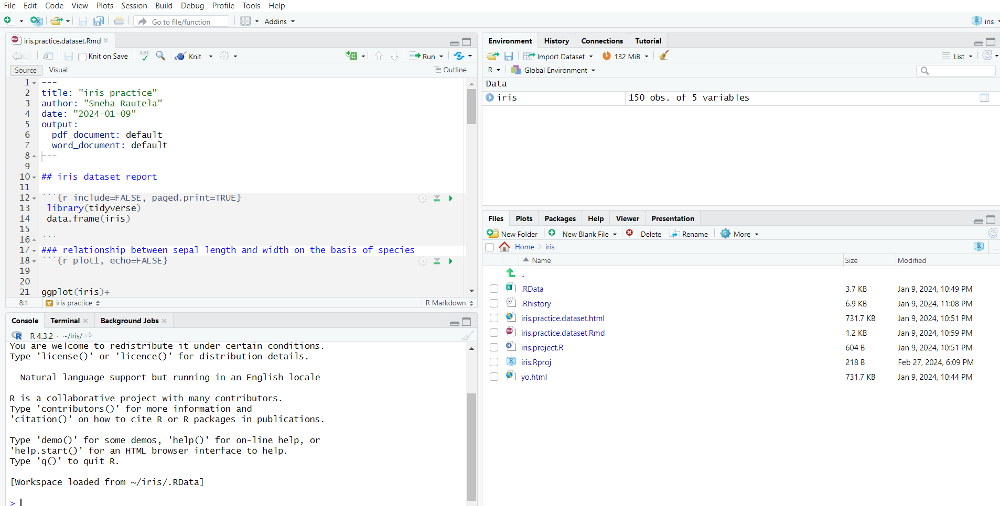

# Iris Project

## Description
This project is visualization project made using R studio, the data was already available in R studio. This project is going to walk you through the species of the iris flower and the relationship between the sepal length, width and petal length, width . 
libraries used : ggplot, tidyverse and
dataset used : iris

## Environments used
R studio

## project walk - through

## final visualization
<object data="iris_flower_R.pdf" width="1000" height="1000" type='application/pdf'></object>
